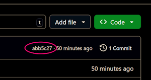

# Assignment 2: Working with Codespaces, Git and Command Line

This is the README file for the second weekly assignment.

## Learning Objectives

1. Getting familiar with the programming environment
2. Practice basic command line commands
3. Learn the basics on how to run python programs
4. Learn the basics on how to use Git commands to submit assignments

## Task 1: Exploring the Codespaces Interface

This is VS Code running in a virtual environment provided by GitHub Codespaces.
This environment is pre-configured with all the tools required for you without
worrying about local setup issues. 

Since we will be using this environment regularly during the semester, spend some time to familiarize yourself with the interface.

1. **File Explorer:** Located at the top left of the screen, it allows you to
   navigate through your project’s files and directories. Here, you will find
   instructions on how to complete the assignments and you can create, rename,
   delete, and manage your files and folders. You'll see a hierarchical view of
   your files, with directories represented by expandable folders. 

2. **Coding Area:** The main part of the screen, this is where you will write
   and edit files. When you open a file, it will appear as a tab in this area.
   You can open multiple files simultaneously, with each file occupying its own
   tab. This makes it easy to switch between different files and work on
   multiple files.

3. **Terminal Window:** Located at the bottom of the screen, the terminal window
   is a command line interface (CLI) that allows you to execute commands
   directly within your coding environment. You can use the terminal to run your
   code, navigate the file system, install software, and perform other tasks
   that require command-line operations. This terminal operates in a Linux
   environment, providing a powerful and flexible tool for your development
   needs.


## Task 2: Scavenger Hunt

Uncover the secret animals hidden in your Codespaces environment! Your
Codespaces environment has been preloaded with a file structure containing
several secret animals for you to discover. For that, you will use the Command
Line Interface (CLI) to practice and get familiar with essential commands we
will use in this course.

As we have discussed in class, CLI commands are fundamental tools for any
programmer. Understanding and effectively using CLI commands can significantly
enhance your productivity, flexibility, and control over your development
environment, especially in the context of Python programming.

While we will learn how to use other means to navigate directory structures and
to submit assignments, in this task, you will practice with CLI to perform these
tasks.  

Before getting started get familiarize with the conventions below.

### Directory Structure

This is the directory structure used in this activity.

`assn-2-username` folder is where all the instructions, questions and auxiliary
programs are located. 

`scavenger_hunt` folder is where animals are hidden.

```
workspaces/
├── assn-2-username/ (assignment files)
│   ├── README.md
│   ├── QUESTIONS.md
│   ├── decode.py
│   └── reveal_animal.py
└── scavenger_hunt/             (scavenger hunt files)
    ├── folder1/
    ├── folder2/
    └── folder3/
```

 1. **Open Your Terminal**

    - The terminal is located at the bottom of the screen

    - If you cannot see it, either:

        * Click on the *hamburger* ☰ menu at the top left, select  **View**
          menu, and select **Terminal**.
        * Use the keyboard shortcut:
          + **Ctrl + `** (backtick) on Windows/Linux
          + **Cmd + `** (backtick) on Mac

2. **Navigate to the `scavenger_hunt` Folder**

    - Your current location in the terminal is `/workspaces/assn-2-yourusername`.

    - To move to the `scavenger_hunt` folder, you first need to go up one level
      in the directory hierarchy to the `workspaces` folder.

    - Use the `cd` (change directory) command to navigate:

      ```bash
      cd ..
      ```

      > *Don't forget the space between `cd` and `..`*

    - This command will move you up one level, placing you in the `workspaces`
      directory.

    - You can type `ls` to confirm that there is a `scavenger_hunt` in the
      `workspaces` folder. Also notice that `assn-2-yourusername` folder is
      there, as well.

    - Now, change your location to the `scavenger_hunt` folder:

      ```bash
      cd scavenger_hunt
      ```

      > **Tip**:
      >
      > - Use `Tab` key to auto-complete. For example: if you are in the
      >   `workspaces` folder, you can type `sca` and press `Tab`. It will
      >   auto-complete to `scavenger_hunt`.
      > - Use `ArrowUp` and `ArrowDown` to see the history of all previous
      >   commands.

3. **Confirm Your Location**

    - You can verify that you are now in the `/workspaces/scavenger_hunt` folder
      by using the `pwd` (print working directory) command:

      ```bash
      pwd
      ```

    - The output should confirm your current location as `/workspaces/scavenger_hunt`.

4. **Start the Scavenger Hunt**

    - In the `/workspaces/scavenger_hunt` directory, you will find various files
      and directories.

    - In your file explorer tab on the right, locate and open the `QUESTIONS.md`
      file to see the questions you need to answer.

5. **Explore Directories and Files**

    - Use commands like `ls` (list), `cd` (change directory), and `cat` (display
      file content) to navigate and search for the secret animals.
      
    - Example commands:

      - List the contents of the current directory (the `l` is an L not a one):

        ```bash
        ls
        ```

        > *HIDDEN FILES:* Files that start with a `.` are considered to be
        > "hidden" in Unix-based operating systems (e.g., Linux and MacoOS). The
        > `ls` command will not display these files by default. To show hidden
        > files you must add an *argument* or *flag*. To include hidden files,
        > use:
        >
        > ```bash
        > ls -A
        > ```
      
      - Change to a different directory:

        ```bash
        cd directory_name
        ```
      
      - Display the content of a file:

        ```bash
        cat file_name
        ```

6. **Answer the Questions**

    As you find the secret animals, record your answers in the `QUESTIONS.md` file.


### Animal Decoding Instructions

Some animals will just be a list of numbers. To identify these animals, you will
need to decode them by running the `decode.py` script. Here’s how you can do it:

1. Open your terminal.

2. `decode.py` is in the `assn-2-yourusername` folder. Refer to the *Directory
   Structure* if you need more details.

You have two options for running Python scripts:

- **Option 1: Navigate to the script location**

    - First, check your current directory location in the terminal.

    - Change your directory to where the scripts are located. The basic idea is:

      ```bash
      cd path/to/assn-2-yourusername
      ```

      But there are multiple options. For example, if you are currently in
      `workspaces/scavenger_hunt/folder1/subfolder1/`, you *can* use a
      *relative* path to change to the appropriate folder:

      ```bash
      cd ../../../assn-2-yourusername/
      ```

      > _**PLEASE**_ don't just copy and paste the above command. `yourusername`
      > is _**YOUR**_ USER NAME. So for example, `assn-2-yourusername` means
      > `assn-2-pythonmaster` or whatever your GitHub user name is.

      Or you can use an *absolute* path to locate the folder. Prefixing the path with a `/` takes you to the root of the file system. Since workspaces is right off of the root, you could simply type:

      ```bash
      cd /workspaces/assn-2-yourusername/
      ```

      > 
      > Alternatively, if chaining together folders like that gets confusing,
      > you can just move around one folder at a time. For example:
      >
      > ```bash
      > cd ..
      > cd ..
      > cd ..
      > ```
      >      
      > These three commands will move you up 3 levels, the first moves you to
      > `folder1`, the second move you to `scavenger_hunt` and the third moves
      > you to `workspaces`. Then, go to the `assn-2-yourusername` directory:
      > 
      > ```bash
      > cd assn-2-yourusername
      > ```
    
    - Now, once in the correct folder, run the script:

      ```bash
      python decode.py
      ```

- **Option 2: Run the scripts from your current location**

  If you prefer to stay in your current directory, you can specify the full path
  to scripts in the form:

  ```bash
  python path/to/script/scriptname.py
  ```

  As above, you could use *relative* addressing. For example, if you are in
  `scavenger_hunt/folder1/subfolder1/`, you could type:
  
  ```bash
  python ../../../assn-2-yourusername/decode.py
  ```
  
  Or as discussed above you can use *absolute* addressing. For example:
  
  ```bash
  python /workspaces/assn-2-yourusername/decode.py
  ```

  Either way, you run scripts without changing your current directory.

## Task 3: Git Commands to Submit the Assignment

Once you finish with the questions, use the following Git commands to submit
your assignment:
  
- Make sure you save all changes in your `QUESTIONS.md` file. Changes are saved
  automatically if you are using Codespaces in the browser.

- In your terminal, ensure that you are in the `assn-2-yourusername` folder. If
  not, `cd` your way there. _**These commands will not work unless you are ih
  the assignment folder.**_

- Use the `git add` command to stage your changes. This command tells Git to
  include updates to specified files in the next commit. To stage your the changes
  to ONLY QUESTIONS.md, you can type:

  ```bash
  git add QUESTIONS.md
  ```

  Or you can stage ALL chaged files with:

  ```bash
  git add .
  ```

  The `.` at the end says add everything in the current folder.

- Use the `git commit` command to commit your staged changes. This records the
  changes in the repository's history. Include a meaningful message with your
  commit:

  ```bash
  git commit -m "Finished with Assignment 2"
  ```

- Use the `git push` command to push your commits to the remote repository on
  GitHub. This updates the remote repository with your local changes.

## Task 4: Validate the Submission and Submit to D2L

The last step that for this and all future assignments is to submit your
assignment to D2L. But in order to do that, you **MUST** first validate that you
correctly submitted the assignment to the GitHub repository.

- Visit the GitHub repository for this assignment.
  + I'd personally keep this open in a separate browser tab. If you're like me,
    then just switch tabs.
  + If not, then the *easiest* way to get back to the repository is to click on
    the invitation link again in D2L.
  + Though, the *proper* way to do this and actually learn how to use GitHub
    would be to go to https://github.com, find the organization for this course,
    and then open the repository from there. Whatever works best for you.

- On the repository page, make sure you are looking at the `<> Code` tab.

- Look at each file in your submission.
  + Click on the file to ensure that your changes are showing.
  + Look at the commit message to ensure that you commit message is as expected.

- Now again back on the `<> Code` tab, look near the top right for something
  that looks like this:

  

  Copy that 7-digit number (it's hexadecimal, so there may be letters, too).

- Return to D2L and paste that ID into the submission comment for this
  assignment.

- Submit the assignment and rejoice.
